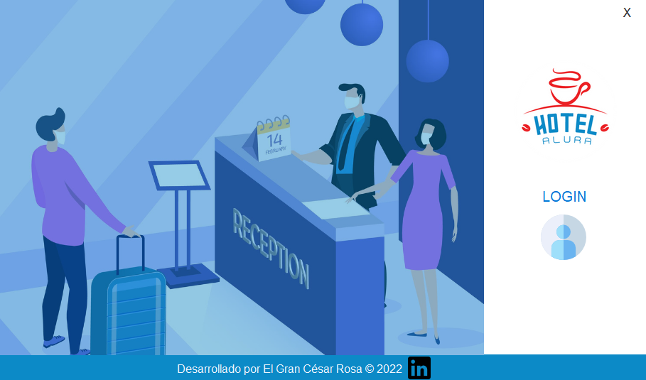

# Challenge ONE | Java | Back-end | Hotel Alura

     

---

 🖥️ Tecnologías Utilizadas:

- Java
- Eclipse
- Biblioteca JCalendar
- Bibliotecas Api Conversion tiempo real
- MySql
- Plugin WindowBuilder  

---
 ⚠️ Importante! ⚠️

☕ Para la realización de este proyeco utilicé la versión 10 de Java.
   

🗒 Descripción:
 
 EL proyecto contiene el JAR ejecutable y el backup de la base de datos que se puede importar en un servidor local o externo para que funcione, se le hicieron algunas modificaciones a la parte gráfica, no demasiadas, porque se hizo incapie en CRUD y MVC, Falto utilizar el comando join para realizar menos conexiones, modificación que realizare posteriormente a la presentación del mismo. También se le incluyo el código del challenge anterior para que de acuerdo a la nacionalidad del Huesped se le presente el valor de la estadía en su moneda local.

 previews

[]

🧡 <strong>Mi Linkedin</strong> 

💙 <strong>Alura Latam</strong> 

